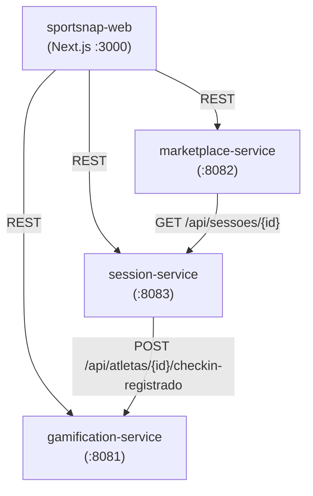

# Arquitetura Distribuída — SportSnap

## Diagrama

## Serviços

| Serviço | Porta | Responsabilidade |
|---|---|---|
| session-service | 8083 | Gerenciar sessões esportivas e check-ins de atletas |
| marketplace-service | 8082 | Gerenciar lotes de fotos, licenças e dashboard do fotógrafo |
| gamification-service | 8081 | Gerenciar cartas de atletas, ranking e sincronização |

## Comunicação REST entre Serviços

### session-service → gamification-service
Após cada check-in em lote, o session-service notifica o gamification-service.
- Endpoint: `POST /api/atletas/{id}/checkin-registrado`
- Payload: `{ "sessaoId": <int> }`
- Implementação: `GamificationCliente.java`

### marketplace-service → session-service
Antes de criar um lote de fotos, o marketplace-service valida que a sessão existe.
- Endpoint: `GET /api/sessoes/{id}`
- Implementação: `SessionCliente.java`

## Funcionalidades com Concorrência

1. **Check-in em Lote (session-service)**
   - Classe: `CheckInLoteServicoAplicacao`
   - Mecanismo: `ExecutorService.newFixedThreadPool(10)` + `ReentrantLock`
   - Endpoint: `POST /api/sessoes/checkins/lote`

2. **Dashboard Paralelo (marketplace-service)**
   - Classe: `DashboardServico`
   - Mecanismo: `CompletableFuture.allOf()` + `AtomicInteger` + `AtomicReference`
   - Endpoint: `GET /api/fotografos/{id}/dashboard`

3. **Ranking Concorrente (gamification-service)**
   - Classe: `RankingServico.calcularRankingConcorrente()`
   - Mecanismo: `ExecutorService.newFixedThreadPool(6)` + `ConcurrentHashMap`
   - Endpoint: `POST /api/ranking/calcular-concorrente`

## Controle de Concorrência na Persistência

### Lock Otimista (`@Version`)
Entidades `SessaoJpa` e `CheckInJpa` possuem campo `@Version int versao`.
O JPA lança `OptimisticLockException` se duas transações tentarem salvar a mesma entidade simultaneamente.

### Lock Pessimista (`@Lock(PESSIMISTIC_WRITE)`)
O método `LicencaDeImagemJpaRepository.findByFotoIdWithLock()` bloqueia o registro no banco
durante a transação, garantindo que apenas uma compra de licença ocorra por vez para a mesma foto.

### Cenário de Concorrência no Banco
**Dois atletas tentam comprar a mesma última licença de foto:**
1. Atleta A inicia transação → adquire PESSIMISTIC_WRITE lock na linha da licença
2. Atleta B tenta iniciar transação → fica aguardando o lock
3. Atleta A conclui a compra → libera o lock
4. Atleta B obtém o lock → verifica disponibilidade → recebe erro de negócio
